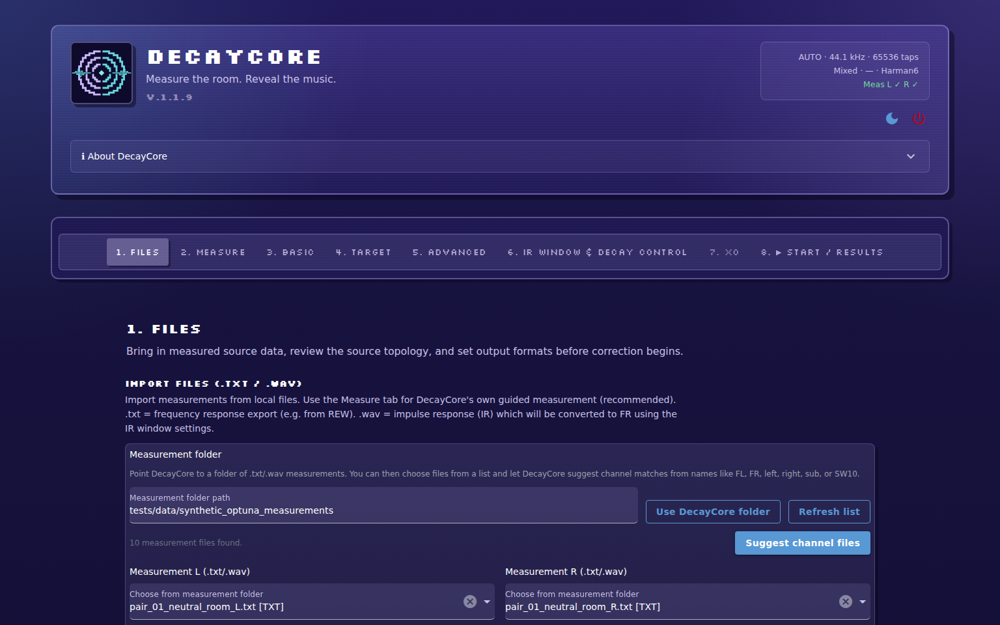
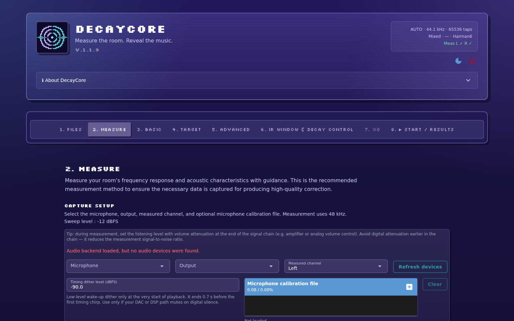
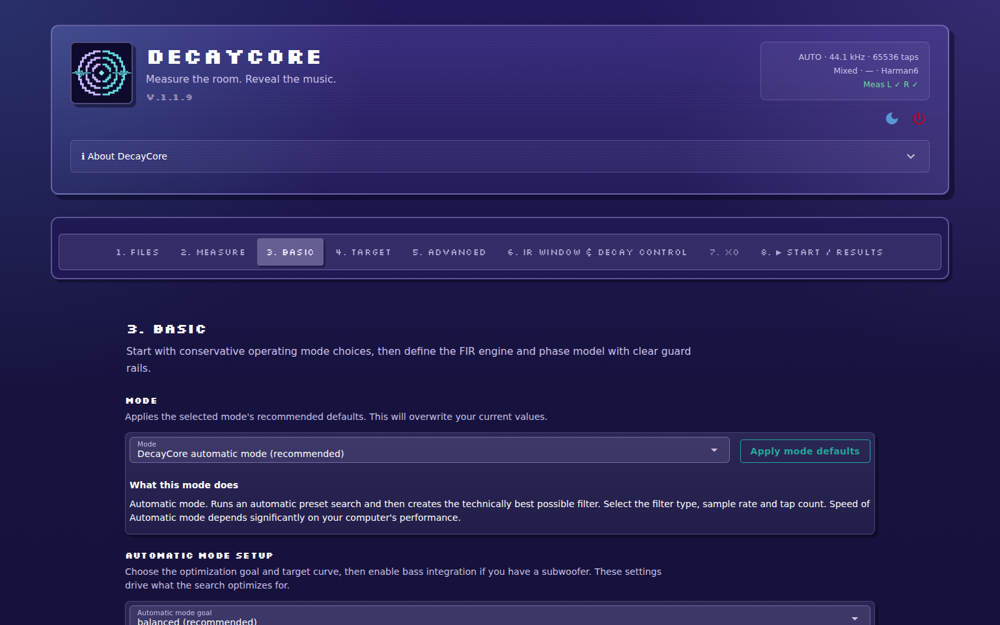
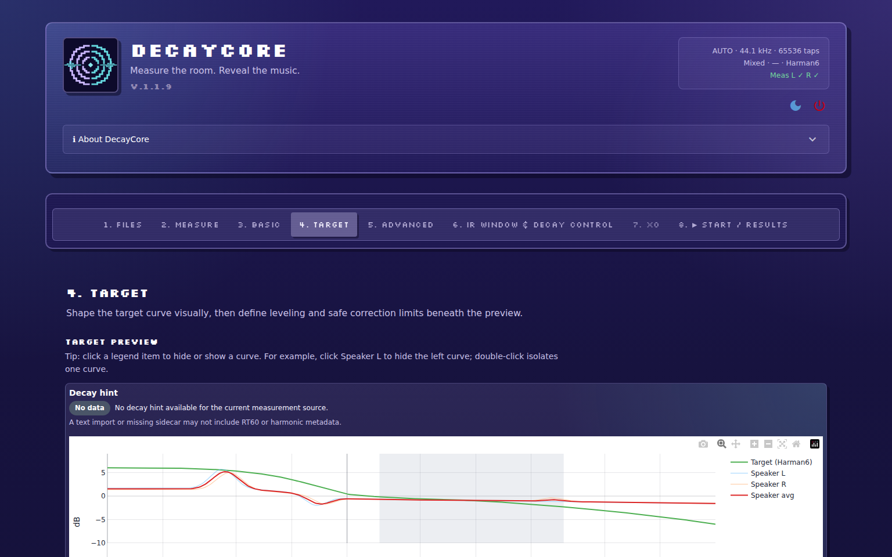
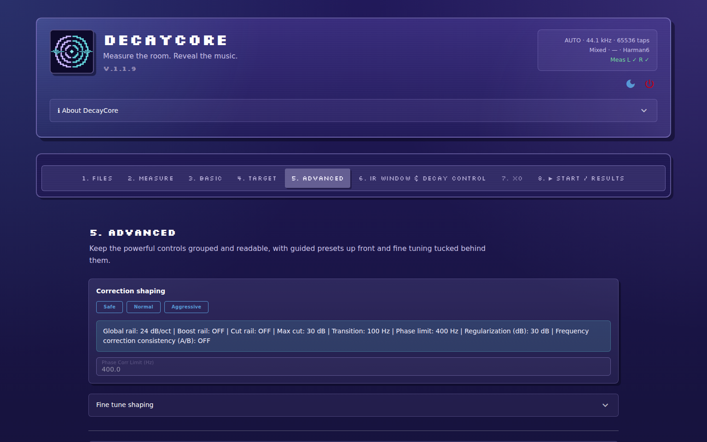
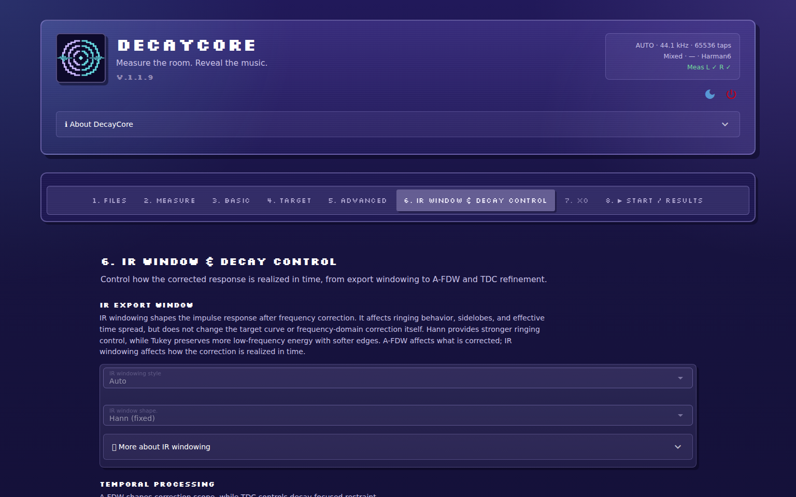
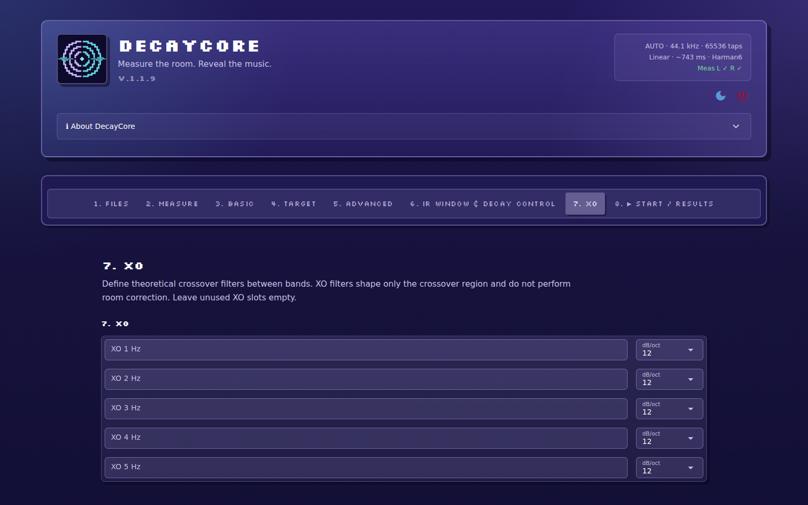
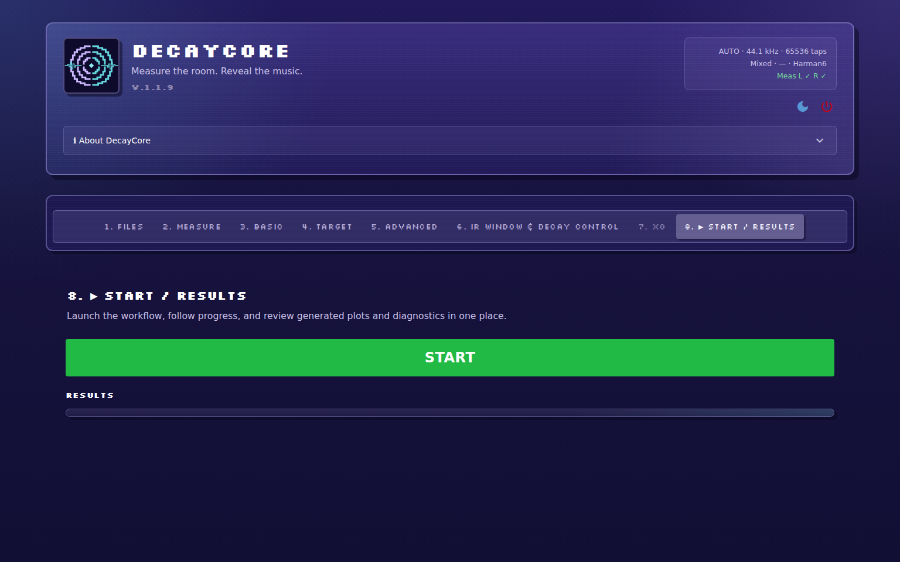

# DecayCore - FIR Room Correction and Acoustic Measurement Tool

DecayCore is a free FIR room correction, acoustic measurement, and filter generation tool. It exports convolution-ready WAV FIR filters compatible with any FIR-capable DSP engine — including CamillaDSP, Roon convolution, Equalizer APO, MiniDSP and similar platforms. The filter-generation source is available for non-commercial use. The packaged release builds include the integrated measurement workflow.

DecayCore includes its own measurement workflow in release builds. The preferred workflow is to measure directly with DecayCore, generate correction filters from those measurements, and export convolution-ready WAV FIR filters.

DecayCore runs through a browser-based user interface. The application starts a local UI that you use in your web browser; it is not a cloud service.

It focuses on physically sane, band-limited room correction instead of simply forcing a flat frequency response. DecayCore prioritizes controlled cuts, containment, and acoustically plausible shaping. Boost is not the primary goal, and remains a bounded, guarded exception only where the measurement supports it. DecayCore supports Linear Phase, Minimum Phase, Mixed Phase and Asymmetric FIR filters, automatic target optimization, phase-aware correction, and Temporal Decay Control for low-frequency room behavior.

>DecayCore was formerly known as CamillaFIR. The project was renamed to avoid confusion with CamillaDSP while keeping full CamillaDSP compatibility.

## Links

- Documentation: https://vilhovalittu.github.io/DecayCore/
- Releases: [DecayCore releases](https://github.com/VilhoValittu/DecayCore/releases)
- Source code: [DecayCore repository](https://github.com/VilhoValittu/DecayCore)

> Important note about the measurement function :
> The integrated measurement function is available only in the packaged versions published under the GitHub Releases section. It is not included in the public source tree. The source repository contains the filter-generation side, while the measurement/acquisition workflow remains available through the released builds.

REW-style measurement data may also be used in compatible workflows, but DecayCore's own measurement workflow is the preferred path.

## What DecayCore does

- Measures loudspeakers and rooms with the built-in measurement workflow in release builds
- Provides a local browser-based user interface
- Generates FIR room correction filters from measurement data
- Exports convolution-ready WAV FIR filters
- Supports CamillaDSP, Roon convolution, Equalizer APO, and other FIR-capable DSP engines
- Supports Linear Phase, Minimum Phase, Mixed Phase and Asymmetric FIR filters
- Prioritizes cuts and bounded shaping over boost-heavy "flatten at any cost" correction
- Uses conservative correction limits to avoid unsafe boosts, deep-null chasing, and unrealistic room correction
- Includes automatic target optimization and Temporal Decay Control

## Screenshots

## Documentation

- [Performance report](https://vilhovalittu.github.io/DecayCore/performance/)
- [Getting started](https://vilhovalittu.github.io/DecayCore/getting-started/)
- [Measurement workflow](https://vilhovalittu.github.io/DecayCore/measurement-workflow/)
- [CamillaDSP FIR room correction](https://vilhovalittu.github.io/DecayCore/camilladsp-fir-room-correction/)
- [FIR room correction](https://vilhovalittu.github.io/DecayCore/fir-room-correction/)
- [Minimum phase FIR filter generation](https://vilhovalittu.github.io/DecayCore/minimum-phase-fir-generator/)
- [Mixed phase room correction](https://vilhovalittu.github.io/DecayCore/mixed-phase-room-correction/)
- [Temporal Decay Control](https://vilhovalittu.github.io/DecayCore/temporal-decay-control/)
- [FAQ](https://vilhovalittu.github.io/DecayCore/faq/)

## Download

Download DecayCore from the official GitHub releases page:

[DecayCore releases](https://github.com/VilhoValittu/DecayCore/releases)

## Contact

Feedback: vilho.valittu@gmail.com

## Python and dependency baseline

All DecayCore versions released and documented in this repository are based on Python `3.12.3`.

The main source environment currently documented by `requirements.txt` uses these pinned package versions:

- `numpy==2.4.6`
- `scipy==1.17.1`
- `nicegui==3.13.0`
- `plotly==6.8.0`
- `optuna==4.9.0`

> `numba` was removed in v1.1.6. The DSP and scoring hot paths it used are now
> provided by two optional Rust extensions (`decaycore-dsp`, `decaycore-scoring`),
> prebuilt in the packaged releases. When running from source they are optional
> (a pure-Python fallback exists) but strongly recommended; building them needs a
> Rust toolchain. See the [Installation guide](https://vilhovalittu.github.io/DecayCore/installation/) for steps.

## License

DecayCore is source-available for personal, educational, research, and other
non-commercial use under the terms of the LICENSE file.

The measurement engine and related acquisition workflow are not included in this
repository and remain proprietary.

Commercial use, integration into commercial audio/DSP products, hosted services,
paid filtering services, or paid measurement/calibration workflows requires
separate written permission.
