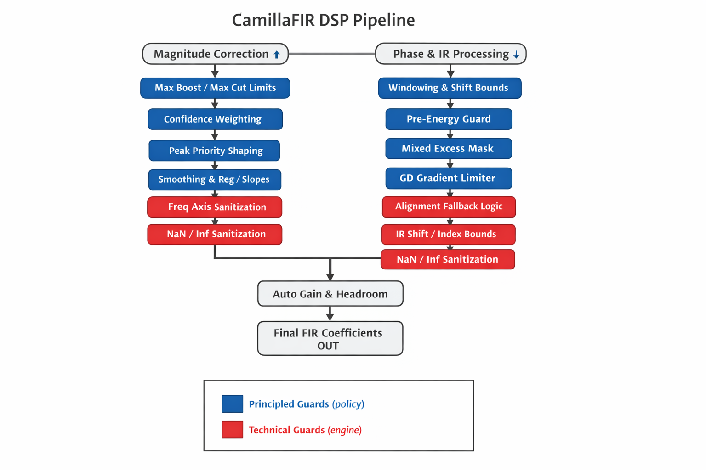

# DecayCore DSP Guards Reference

This document defines all major guard mechanisms in the DSP pipeline and classifies them as either:

- **Principled Guard** → Part of DSP philosophy (defines intended acoustic behavior)
- **Technical Guard** → Implementation safety mechanism (prevents instability, invalid math, or edge-case failure)

Each guard includes:
- Location (module level)
- Typical config keys (if applicable)
- Pipeline stage
- Why it exists (design intent)
- What failure it prevents (engineering perspective)

---

# PRINCIPLED GUARDS

These define how DecayCore is *intended* to behave acoustically.
They shape correction philosophy, realism, and robustness.

---

## 1. Mixed Excess Mask (LF-only phase blending)
**Location:** dsp_phase / mixed-phase logic
**Stage:** Phase construction

**Why:**
Restricts excess-phase correction primarily to low frequencies with a soft transition band.

**Prevents:**
- Unrealistic full-band phase manipulation
- Audible timing artifacts in mid/high frequencies
- Excessive group delay distortion

---

## 2. Pre-Energy / Pre-Ringing Guard
**Location:** dsp/phase_ir_guards.py
**Stage:** Post phase-IR generation

**Config (typical):**
- enable_ir_pre_energy_guard
- pre_energy_ratio_max
- max_pre_ringing_db

**Why:**
Limits excessive energy before the main impulse peak to preserve transient realism.

**Prevents:**
- Strong pre-ringing
- Non-physical impulse shapes
- Audible temporal smearing

---

## 3. Max Boost / Max Cut Limits
**Location:** dsp/correction_mag.py, dsp/limits.py
**Stage:** Magnitude correction

**Config (typical):**
- max_boost_db
- max_cut_db
- bass_boost_cap_* (optional LF refinement)

**Why:**
Prevents unrealistic amplification demands on the system.

**Prevents:**
- Clipping
- Driver overload
- Unrealistic correction into deep nulls

---

## 4. Peak Priority Shaping
**Location:** dsp/correction_mag.py
**Stage:** Error shaping

**Config (typical):**
- peak_priority_enable
- peak_priority_strength

**Why:**
Reduces boost into narrow dips/nulls where correction is physically ineffective.

**Prevents:**
- Aggressive null-filling
- Excessive localized boost

---

## 5. Regularization
**Location:** dsp/correction_mag.py
**Stage:** Target shaping

**Config (typical):**
- reg_strength

**Why:**
Globally pulls correction toward 0 dB to improve robustness.

**Prevents:**
- Over-aggressive full-band correction
- Excess reliance on hard caps

---

## 6. Smoothing (Magnitude Domain)
**Location:** dsp/correction_mag.py
**Stage:** Target conditioning

**Why:**
Smooths the correction curve to improve spatial robustness and perceptual stability.

**Prevents:**
- Sawtooth filters
- Overfitting to measurement noise

---

## 7. Confidence-Based Weighting / Target Pull
**Location:** dsp/correction_mag.py, dsp/decaycore_dsp.py
**Stage:** Target blending

**Config (typical):**
- conf_floor / conf_ceil
- gamma_cut / gamma_boost

**Why:**
Reduces correction strength in low-confidence regions.

**Prevents:**
- Overcorrection in unreliable measurement areas
- Excess boost in cancellation-dominated regions

---

## 8. Auto Headroom / Auto Gain
**Location:** dsp/phase_ir_autogain.py
**Stage:** Final normalization

**Config (typical):**
- auto_headroom_enable
- auto_gain_spike_threshold_db

**Why:**
Ensures safe global output level.

**Prevents:**
- Clipping after filter export
- Hidden overload caused by combined boosts

---

## 9. GD Gradient Limiter
**Location:** dsp/decaycore_dsp.py
**Stage:** Phase-domain limiting

**Why:**
Constrains extreme group delay slope (ms/octave), especially in LF.

**Prevents:**
- Unrealistic timing behavior
- Excessively steep excess-phase transitions

---

# TECHNICAL GUARDS

These ensure numerical and structural stability.
They must remain always-on and are not part of user-facing philosophy.

---

## 1. IR Shift / Alignment Bounds
**Location:** dsp/phase_ir_align.py
**Stage:** IR alignment

**Why:**
Prevents illegal impulse shifts beyond window boundaries.

**Prevents:**
- Lost impulse peaks
- Index overflow
- Truncated IR

---

## 2. Alignment Fallback Logic
**Location:** dsp/phase_ir_align.py
**Stage:** Alignment target computation

**Why:**
Ensures safe defaults if centroid/peak detection fails.

**Prevents:**
- Undefined alignment targets
- Broken timing

---

## 3. Window Auto-Asymmetry Cap
**Location:** dsp/phase_ir_window.py
**Stage:** Windowing

**Why:**
Limits extreme asymmetric window selections.

**Prevents:**
- Impulse truncation
- Edge instability

---

## 4. NaN / Inf Sanitization
**Location:** Multiple modules
**Stage:** Throughout pipeline

**Why:**
Ensures stable numerical behavior.

**Prevents:**
- FFT explosions
- Derivative instability
- Invalid magnitude/phase arrays

---

## 5. Frequency Axis Sanitization
**Location:** dsp_preprocess / dsp_correction
**Stage:** Preprocessing

**Why:**
Guarantees monotonic and unique frequency axis.

**Prevents:**
- Derivative math failure
- Interpolation instability

---

# Dependency Map (Dominance Overview)

This section describes which mechanisms typically dominate when multiple guards affect the same risk.

Legend:
- A → B : If A is strong, B becomes mostly a safety net.
- A ⇄ B : Partial overlap or tuning interaction.

---

## Boost / Headroom Cluster
Regularization → Peak Priority → Max Boost/Cut → Auto Headroom

Upstream shaping should reduce how often hard caps are needed.

---

## Overfitting / Sawtooth Cluster
Smoothing → (reduces need for) Slope Limits
Smoothing ⇄ Regularization
Confidence Weighting ⇄ Regularization

Slope limiting should rarely dominate if smoothing is well tuned.

---

## Mixed-Phase Stability Cluster
Mixed Excess Mask → (reduces need for) GD Gradient Limiter

If GD limiter activates frequently, the excess mask is too permissive.

---

## Time-Domain Stability Cluster
Alignment Bounds → Window Cap → Pre-Energy Guard

If pre-energy guard activates often, upstream alignment/window policy should be revised.

---

# Trigger Matrix (Operational Monitoring)

Healthy system expectations:

Often active but gentle:
- Confidence weighting
- Smoothing
- Regularization
- Auto headroom

Occasional safety nets:
- Max boost/cut
- Peak priority
- Alignment clamp

Rare last-resort guards:
- Slope limit
- Pre-energy guard
- GD gradient limiter
- Spike guard
- NaN sanitization

If a rare guard triggers frequently, treat it as an upstream design issue rather than a tuning feature.

---

# Design Rule

Principled guards define intended acoustic behavior.
Technical guards ensure mathematical and structural stability.

Principled guards may be user-adjustable.
Technical guards must never be disabled.

---

### 1. Overview

### Disclaimer
AI was used to translate this document from Finnish to English.
